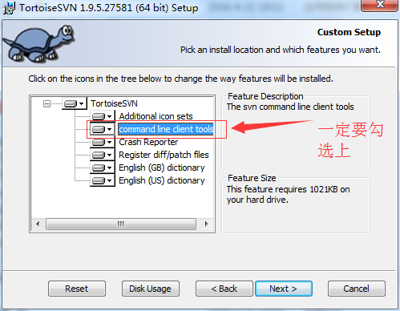
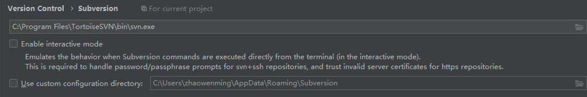
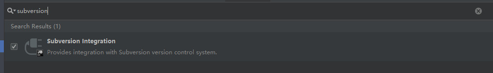
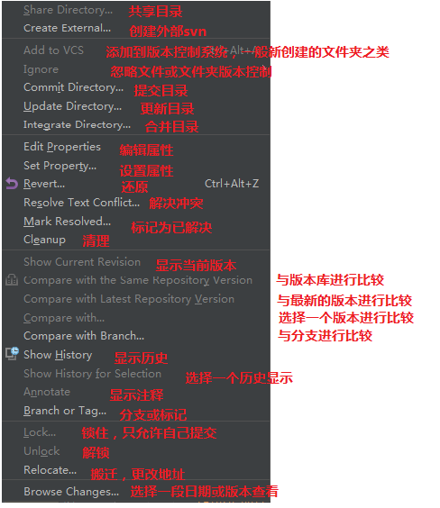

# idea中安装svn
1. svn重新安装

   注意：如图所示的command line一定要安装（默认不安装）

   

然后继续，安装完毕ok

2.svn配置

idea窗口下，依次点击File-Setting-Subversion，路径选择框中选择，本地svn的安装路径，必须时svn.exe

注意：上图左侧的两个勾选框不要勾选

3.idea安装svn插件

在idea窗口下，依次点击File-Setting-Plugins，在搜索框中输入subversion，左侧打勾进行安装

4.此时，idea toolbar上会出现

代表svn安装成功。

5.svn拉项目

idea窗口下，依次点击File-New-Project From Version Control-SubVersion,输入仓库，选则下拉到的地址，ok

6.svn使用

右键项目文件的任意文件夹或者文件，点击subversion，会出现下图，表示svn的功能

7.idea->Settings 搜索 file status 查看文件颜色代表的含义

**颜色**

- **红色：**未加入版本控制
- **绿色：**已经加入控制暂未提交
- **蓝色：**加入，已提交，有改动
- **白色**：加入，已提交，无改动
- **青绿色**：忽略的文件